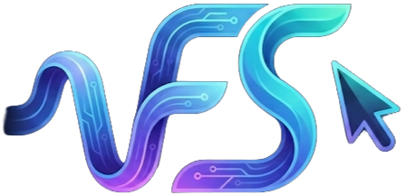

<a id="readme-top"></a>

[![Contributors][contributors-shield]][contributors-url]
[![Forks][forks-shield]][forks-url]
[![Stargazers][stars-shield]][stars-url]
[![Issues][issues-shield]][issues-url]
[![MIT License][license-shield]][license-url]

<!-- PROJECT LOGO -->
<br />
<div align="center">
  <a href="https://github.com/hammersurf1/FlowState">
    
  </a>

<h3 align="center">FlowState</h3>

  <p align="center">
    A realistic typing simulator that pastes clipboard content by "typing" it out with human-like imperfections.
    <br />
    <a href="https://github.com/hammersurf1/FlowState"><strong>Explore the docs »</strong></a>
    <br />
    <br />
    <a href="https://github.com/hammersurf1/FlowState">View Demo</a>
    &middot;
    <a href="https://github.com/hammersurf1/FlowState/issues/new?labels=bug&template=bug-report---.md">Report Bug</a>
    &middot;
    <a href="https://github.com/hammersurf1/FlowState/issues/new?labels=enhancement&template=feature-request---.md">Request Feature</a>
  </p>
</div>

<!-- TABLE OF CONTENTS -->
<details>
  <summary>Table of Contents</summary>
  <ol>
    <li>
      <a href="#about-the-project">About The Project</a>
      <ul>
        <li><a href="#built-with">Built With</a></li>
      </ul>
    </li>
    <li>
      <a href="#getting-started">Getting Started</a>
      <ul>
        <li><a href="#prerequisites">Prerequisites</a></li>
        <li><a href="#installation">Installation</a></li>
      </ul>
    </li>
    <li><a href="#usage">Usage</a></li>
    <li><a href="#roadmap">Roadmap</a></li>
    <li><a href="#contributing">Contributing</a></li>
    <li><a href="#license">License</a></li>
    <li><a href="#contact">Contact</a></li>
    <li><a href="#acknowledgments">Acknowledgments</a></li>
  </ol>
</details>

<!-- ABOUT THE PROJECT -->
## About The Project

<!-- [![FlowState Screen Shot][product-screenshot]](https://github.com/hammersurf1/FlowState) -->

FlowState is a cross-platform typing simulator designed for intelligent humanlike autotyping. Unlike standard macro pastes that dump text instantly, FlowState simulates a human touch by incorporating:

* **Natural Rhythm:** Gaussian distribution for keystroke delays to avoid robotic patterns.
* **Context Awareness:** Faster typing on common bigrams and realistic pauses at punctuation.
* **Intelligent Errors:** Simulated mistakes determined by content, followed by realistic correction pauses.
* **Cognitive Pauses:** Random "thinking" moments and paragraph breaks.

<p align="right">(<a href="#readme-top">back to top</a>)</p>

### Built With

* [![Python][Python.org]][Python-url]
* [![Pillow][Pillow.readthedocs.io]][Pillow-url]
* [![PyPI][PyPI.org]][PyPI-url]

<p align="right">(<a href="#readme-top">back to top</a>)</p>

<!-- GETTING STARTED -->
## Getting Started

To get FlowState up and running on your machine, follow these steps.

### Prerequisites

You will need Python 3.x installed.

### Installation

1. Clone the repo
   ```sh
   git clone https://github.com/hammersurf1/FlowState.git
   ```
2. Install dependencies
   ```sh
   pip install -r requirements.txt
   ```
3. Run the application
   ```sh
   python main.py
   ```

<p align="right">(<a href="#readme-top">back to top</a>)</p>

<!-- USAGE EXAMPLES -->
## Usage

1. **Copy text** to your clipboard (`Ctrl + C`).
2. **Place your cursor** in the target text field.
3. Press **`Ctrl + Alt + V`** to start the typing simulation.

### Controls
* **Ctrl + Alt + V:** Start / Pause / Resume typing.
* **Esc:** Pause immediately.
* **Esc (Double-tap):** Abort and reset.
* **Alt + ↑ / ↓:** Cycle through settings (Speed, Variance, Typo Chance, etc.).
* **Alt + ← / →:** Adjust the selected setting value in real-time.

<p align="right">(<a href="#readme-top">back to top</a>)</p>

<!-- ROADMAP -->
## Roadmap

- [x] Windows Support
- [x] macOS Support
- [ ] Linux Driver Implementation
- [ ] Custom Macro Support
- [ ] Profile Saving/Loading
- [ ] Intelligent revision history w/ NLP

See the [open issues](https://github.com/hammersurf1/FlowState/issues) for a full list of proposed features (and known issues).

<p align="right">(<a href="#readme-top">back to top</a>)</p>

<!-- CONTRIBUTING -->
## Contributing

Contributions are what make the open source community such an amazing place to learn, inspire, and create. Any contributions you make are **greatly appreciated**.

If you have a suggestion that would make this better, please fork the repo and create a pull request. You can also simply open an issue with the tag "enhancement".
Don't forget to give the project a star! Thanks again!

1. Fork the Project
2. Create your Feature Branch (`git checkout -b feature/AmazingFeature`)
3. Commit your Changes (`git commit -m 'Add some AmazingFeature'`)
4. Push to the Branch (`git push origin feature/AmazingFeature`)
5. Open a Pull Request

<p align="right">(<a href="#readme-top">back to top</a>)</p>

### Top contributors:

<a href="https://github.com/hammersurf1/FlowState/graphs/contributors">
  
</a>

<!-- LICENSE -->
## License

Distributed under the MIT License. See `LICENSE.txt` for more information.

<p align="right">(<a href="#readme-top">back to top</a>)</p>

<!-- ACKNOWLEDGMENTS -->
## Acknowledgments

* [keyboard library](https://github.com/boppreh/keyboard)
* [pystray](https://github.com/moses-palmer/pystray)
* [Best-README-Template](https://github.com/othneildrew/Best-README-Template)

<p align="right">(<a href="#readme-top">back to top</a>)</p>

<!-- MARKDOWN LINKS & IMAGES -->
<!-- https://www.markdownguide.org/basic-syntax/#reference-style-links -->
[contributors-shield]: https://img.shields.io/github/contributors/hammersurf1/FlowState.svg?style=for-the-badge
[contributors-url]: https://github.com/hammersurf1/FlowState/graphs/contributors
[forks-shield]: https://img.shields.io/github/forks/hammersurf1/FlowState.svg?style=for-the-badge
[forks-url]: https://github.com/hammersurf1/FlowState/network/members
[stars-shield]: https://img.shields.io/github/stars/hammersurf1/FlowState.svg?style=for-the-badge
[stars-url]: https://github.com/hammersurf1/FlowState/stargazers
[issues-shield]: https://img.shields.io/github/issues/hammersurf1/FlowState.svg?style=for-the-badge
[issues-url]: https://github.com/hammersurf1/FlowState/issues
[license-shield]: https://img.shields.io/github/license/hammersurf1/FlowState.svg?style=for-the-badge
[license-url]: https://github.com/hammersurf1/FlowState/blob/master/LICENSE.txt
[product-screenshot]: assets/screenshot.png

[Python.org]: https://img.shields.io/badge/Python-3776AB?style=for-the-badge&logo=python&logoColor=white
[Python-url]: https://www.python.org/
[Pillow.readthedocs.io]: https://img.shields.io/badge/Pillow-111111?style=for-the-badge&logo=python&logoColor=white
[Pillow-url]: https://python-pillow.org/
[PyPI.org]: https://img.shields.io/badge/PyPI-3775A9?style=for-the-badge&logo=pypi&logoColor=white
[PyPI-url]: https://pypi.org/
